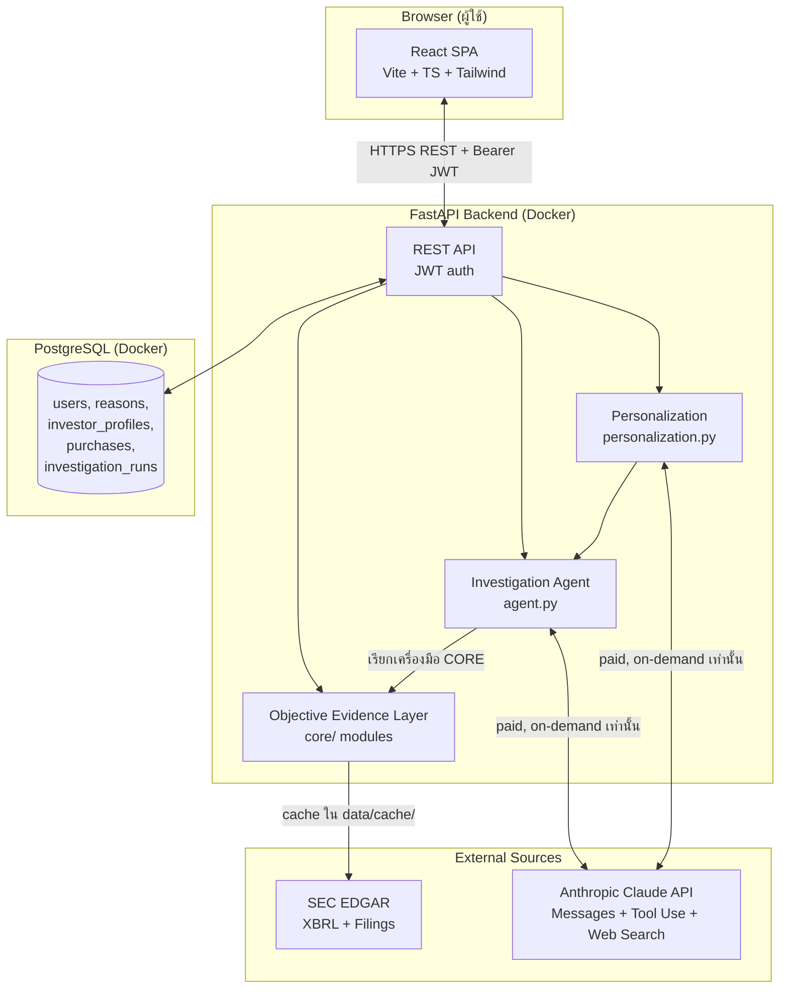
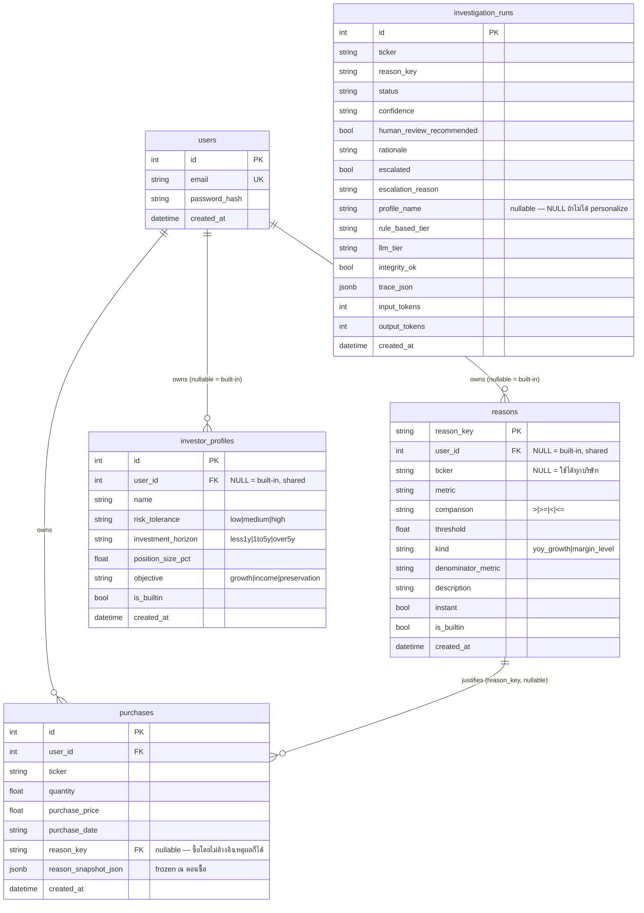

# Architecture — Agentic AI for Evidence-Grounded Revalidation of Investment Assumptions

เอกสารนี้อธิบายสถาปัตยกรรมทั้งระบบ ณ จุดที่ project ย้ายจาก Flask+SQLite (prototype เดิม) มาเป็น
FastAPI + PostgreSQL + React stack เต็มรูปแบบ ครอบคลุมตั้งแต่ data layer, domain logic
(Objective Evidence Layer), Investigation Agent, Investor Context Layer, ไปจนถึง web app และ
frontend จริง พร้อมเหตุผลของการตัดสินใจสำคัญแต่ละจุด

> เอกสารคู่กัน: `PROPOSAL.md` (โจทย์วิจัย/scope/contribution), `README.md` (log การพัฒนาและผลทดสอบจริง
> แบบละเอียดทีละ feature), `LITERATURE_REVIEW.md`

---

## 1. ภาพรวมระบบ (High-Level Overview)

ระบบมี 2 ส่วนที่แยกกันชัดเจนตามเจตนา:

1. **Objective Evidence Layer** — เครื่องมือ/สคริปต์ Python ล้วน (ไม่มี framework agent ของตัวเอง)
   ที่ดึงข้อมูลจริงจาก SEC EDGAR (XBRL Company Facts + 10-Q/10-K/8-K filings) แล้วตัดสิน
   Supported / Weakened / Broken / Not enough data สำหรับ "เหตุผลการลงทุน" แต่ละข้อ แบบ
   point-in-time (จำลองว่า ณ วันที่ X รู้อะไรบ้าง ไม่ใช่ข้อมูลปัจจุบันย้อนไปตัดสินอดีต) — นี่คือ
   research contribution หลักของ IS นี้ ไม่ใช่ตัว agent
2. **Web Application** — FastAPI backend (PostgreSQL) + React frontend ที่ห่อ Layer ข้างต้นไว้เป็น
   ผลิตภัณฑ์ใช้งานได้จริง: register/login, ตั้งเงื่อนไขเอง, คัดกรองหุ้น (screener), บันทึกการซื้อพร้อม
   snapshot เหตุผล, และติดตามว่าเหตุผลตอนซื้อยังจริงอยู่ไหม

หลักการที่ยึดตลอดทั้งระบบ: **การคำนวณ/ตัดสิน status ของเหตุผลต้อง deterministic และฟรี (ไม่มี LLM)
เสมอ** — LLM (Claude) เข้ามาเกี่ยวข้องเฉพาะ 2 จุดที่ user กดเรียกเองอย่างชัดเจนเท่านั้น คือ
**Investigation Agent** (`POST /api/ask-agent/{ticker}`) และ **Personalization**
(`POST /api/personalize/{ticker}`) ทั้งสองจุดมี cost-confirmation UI กันไว้ไม่ให้ยิงโดยไม่ตั้งใจ



---

## 2. Technology Stack

| Layer | เทคโนโลยี | เหตุผลที่เลือก |
|---|---|---|
| **Frontend framework** | React 18.3 + TypeScript 5.5 + Vite 5.4 | เร็ว, type-safe, ecosystem ใหญ่, ผู้พัฒนาคุ้นเคยอยู่แล้ว |
| **UI / Styling** | Tailwind CSS 3.4 + shadcn/ui pattern (Radix UI primitives เขียนเอง: dialog, alert-dialog, select, tabs, label) | ควบคุม design token ได้เต็มที่ ไม่ผูก dependency หนักอย่าง MUI |
| **Data fetching / cache** | TanStack Query 5.59 | จัดการ loading/error/cache/invalidate ให้อัตโนมัติ แทนการเขียน `useEffect` + `fetch` มือ |
| **Routing** | React Router 6.26 | แยก `/login`, `/`, `/screener`, `/portfolio`, `/profiles` พร้อม protected-route gate |
| **HTTP client** | axios (พร้อม interceptor แนบ `Authorization: Bearer <token>` และ auto-logout เมื่อเจอ 401) | จัดการ error/interceptor สะดวกกว่า fetch ดิบ |
| **Backend framework** | FastAPI (Python 3.11) | async, validation ผ่าน Pydantic อัตโนมัติ, OpenAPI docs ฟรี, เหมาะกับ Python ecosystem เดียวกับ domain logic เดิม |
| **ORM / Migration** | SQLAlchemy 2.0 + Alembic | จัดการ schema, foreign key, JSONB ได้เป็นระบบ พร้อม migration history ที่ track ได้ |
| **Database** | **PostgreSQL 16** (เดิมเป็น SQLite) | **เปลี่ยนจาก SQLite ตามคำแนะนำ**: ข้อมูลของระบบนี้มีความสัมพันธ์กันชัดเจนมาก (user → screening rule → position → reason snapshot → evaluation) เหมาะกับ Relational DB มากกว่า Document/Vector DB, รองรับ JSONB สำหรับ field ที่ structure ไม่ตายตัว (เช่น reason snapshot, agent trace), และรองรับ concurrent access ที่ SQLite ทำได้จำกัด |
| **Auth** | JWT (PyJWT) + password hashing ด้วย `werkzeug.security` (bcrypt-based) | Stateless token เหมาะกับ frontend คนละ origin (SPA แยกจาก backend) ต่างจาก Flask session cookie เดิมที่ผูกกับ server-rendered HTML |
| **LLM** | Anthropic Claude (`claude-sonnet-4-5-20250929`) ผ่าน raw HTTP POST ไปที่ Messages API โดยตรง (ไม่ใช้ `anthropic` SDK เพราะ SDK เจอ bug decompression ใน environment นี้) | Tool-use feature ของ Claude คือแกนของ Investigation Agent — ดูหัวข้อ 5 |
| **External data source** | SEC EDGAR: XBRL **Company Facts API** (`data.sec.gov`), 10-Q/10-K/8-K full-text filings | แหล่งข้อมูลทางการที่มี point-in-time filing date กำกับทุกตัวเลข — หัวใจของ Contribution 1 |
| **Containerization** | Docker Compose: 3 services (`postgres`, `backend`, `frontend`) | รันทั้ง stack ด้วยคำสั่งเดียว `docker compose up`, `backend`/`frontend` mount volume + hot-reload สำหรับ dev |
| **i18n** | ระบบเขียนเอง (ไม่ใช้ library) — `LanguageProvider` + `useTranslation()` + dictionary EN/TH ใน `localStorage` | เบา, ไม่มี dependency เพิ่ม, ตรงกับสไตล์ "no framework where plain code does the job" ของ project |

---

## 3. โครงสร้าง Repository

```
Invesment/
├── backend/                          # FastAPI + PostgreSQL (product web app)
│   ├── app/
│   │   ├── main.py                   # FastAPI app, CORS, router wiring, startup (db.init_db)
│   │   ├── config.py                 # env vars: DATABASE_URL, JWT_*, CORS_ORIGINS
│   │   ├── security.py               # JWT create/verify, current_user_id() dependency
│   │   ├── api/                      # REST routers (ดูหัวข้อ 6)
│   │   │   ├── auth.py               # /api/auth/register, /login, /me
│   │   │   ├── companies.py          # /api/companies
│   │   │   ├── reports.py            # /api/report/{ticker}, /ask-agent, /personalize
│   │   │   ├── reasons.py            # /api/reasons, /api/xbrl-tags/{ticker}
│   │   │   ├── screener.py           # /api/screen (multi-rule)
│   │   │   ├── positions.py          # /api/positions (ซื้อ/ลบ)
│   │   │   ├── portfolio.py          # /api/portfolio/summary
│   │   │   └── profiles.py           # /api/profiles
│   │   ├── db/
│   │   │   ├── session.py            # SQLAlchemy engine/session/Base
│   │   │   └── models.py             # ORM models: User, Reason, InvestorProfile,
│   │   │                             #   InvestigationRun, Purchase
│   │   └── core/                     # Objective Evidence Layer — คัดลอกมาจาก src/ แบบ
│   │       │                         #   แทบไม่แก้ (ยกเว้น db.py ที่เขียนใหม่เป็น Postgres)
│   │       │                         #   เพื่อไม่เสี่ยง regress logic ที่ผ่านการทดสอบกับข้อมูลจริง
│   │       │                         #   และเงินจริงมาแล้ว — ดูหัวข้อ 4-5
│   │       ├── sec_client.py         # SEC EDGAR HTTP client + local cache
│   │       ├── xbrl_extract.py       # แปลง XBRL JSON → Fact objects, point-in-time filter
│   │       ├── models.py             # Fact / Reason / Evaluation dataclasses
│   │       ├── reason_engine.py      # Supported/Weakened/Broken classification
│   │       ├── earnings_release.py   # parse ตัวเลขจาก 8-K earnings release
│   │       ├── filing_context.py     # ดึง narrative text จาก MD&A section
│   │       ├── tools.py              # Tool layer (Rule Engine, Calculator, ฯลฯ) + REASON_DEFS
│   │       ├── investigation_state.py# InvestigationState + assess_sufficiency (evidence gate)
│   │       ├── agent.py              # run_rule_based / run_with_llm — Investigation Agent
│   │       ├── investor_profile.py   # InvestorProfile dataclass + built-in profiles
│   │       ├── personalization.py    # rule_based_tier / llm_tier / investigate_and_personalize
│   │       ├── portfolio_report.py   # build_company_reasons (รวม built-in + custom reasons)
│   │       └── db.py                 # Postgres persistence (แทน src/db.py เดิม)
│   ├── alembic/                      # migration scripts (versioned schema history)
│   ├── requirements.txt
│   ├── Dockerfile
│   └── .env.example
│
├── frontend/                          # React + TS + Vite (product web app)
│   └── src/
│       ├── main.tsx                   # entry: QueryClientProvider > AuthProvider >
│       │                              #   LanguageProvider > BrowserRouter > App
│       ├── App.tsx                    # route table
│       ├── types.ts                   # TypeScript interface ตรงกับ REST contract ทั้งหมด
│       ├── api/                       # 1 ไฟล์ต่อ resource: auth, companies, reasons, report,
│       │                              #   screen, positions, profiles (axios calls, typed)
│       ├── hooks/                     # TanStack Query hook ต่อ resource (use-report,
│       │                              #   use-screen, use-positions, ...) + query-keys.ts
│       ├── i18n/                      # translations.ts (EN/TH dict) + context.tsx (Provider/hook)
│       ├── lib/                       # auth-storage.ts (token ใน localStorage), utils.ts (cn())
│       ├── components/
│       │   ├── app-layout.tsx         # sidebar/topbar shell, nav, EN/TH toggle, logout
│       │   ├── protected-route.tsx    # redirect gate (ล็อกอิน ↔ ไม่ล็อกอิน)
│       │   ├── status-badge.tsx       # badge สี Supported/Weakened/Broken/Not enough data
│       │   ├── cost-confirm-dialog.tsx# AlertDialog กลางสำหรับ endpoint ที่เสียตัง
│       │   ├── dashboard/             # company-list, reason-report-card, create-reason-form,
│       │   │                          #   record-purchase-form, ask-agent-panel
│       │   └── ui/                    # shadcn-style primitives (button, card, dialog, select, ...)
│       └── pages/                     # auth, dashboard, screener, portfolio, profiles
│
├── src/                                # โค้ดวิจัยเดิม (Phase 1 SQLite prototype + สคริปต์ทดลอง
│                                        #   ทั้งหมด: baseline1/2.py, run_full_experiment.py,
│                                        #   run_consistency_experiment.py, sensitivity_analysis.py,
│                                        #   ฯลฯ) — **ยังคงอยู่ ไม่ย้าย** เพราะสคริปต์ทดลองทั้งหมด
│                                        #   (evidence สำหรับ IS) ผูกกับ src/db.py (SQLite) และ
│                                        #   ไม่ต้องการ multi-user/Postgres — แยก concern ชัดเจน:
│                                        #   src/ = งานวิจัย/experiment, backend/+frontend/ = ผลิตภัณฑ์
├── data/                                # cache ของ SEC responses, gold-set JSON ฯลฯ (gitignored
│                                        #   ยกเว้นไฟล์ JSON ผลการทดลองที่ตั้งใจ commit)
├── docker-compose.yml                   # postgres + backend + frontend, รันด้วยคำสั่งเดียว
├── PROPOSAL.md / README.md / LITERATURE_REVIEW.md
└── ARCHITECTURE.md                      # ไฟล์นี้
```

---

## 4. Objective Evidence Layer (Contribution 1–2) — รากฐานที่ Investigation Agent ยืนอยู่บน

โมดูลกลุ่มนี้ **ไม่มี LLM เกี่ยวข้องเลย** เป็น pure deterministic pipeline ที่ Investigation Agent
เรียกใช้เป็น "เครื่องมือ" เท่านั้น

### 4.1 `sec_client.py` — SEC EDGAR client
- ดึงข้อมูลจาก SEC XBRL **Company Facts API** (`https://data.sec.gov/api/xbrl/companyfacts/CIK##########.json`)
  สำหรับ 15 บริษัทตัวอย่าง (`KNOWN_CIKS`: AAPL, MSFT, NVDA, GOOGL, AMZN, META, TSLA, PEP, JNJ, PG,
  KO, WMT, NFLX, ORCL, COST) — CIK มาจาก mapping จริงของ SEC ไม่ใช่พิมพ์มือ
- cache local เป็นไฟล์ JSON ที่ `data/cache/` เพื่อลด HTTP call ซ้ำ
- ดึงเนื้อหา full-text filing (10-Q/10-K/8-K) ผ่าน `get_document_text` สำหรับ `filing_context.py`/`earnings_release.py`

### 4.2 `xbrl_extract.py` — point-in-time extraction
- แปลง XBRL JSON → รายการ `Fact` object โดยแต่ละ `Fact` มี `filed` date กำกับ (**วันที่บริษัท
  ยื่นตัวเลขนี้จริง** ไม่ใช่วันที่ของ period) — นี่คือกลไกที่ทำให้ "simulate ว่า ณ วันที่ X รู้
  อะไรบ้าง" เป็นไปได้จริง (`facts_as_of(facts, as_of_date)` กรองเฉพาะ fact ที่ `filed <= as_of_date`)
- `latest_version_per_quarter()` รวมทุก version ของตัวเลขในไตรมาสเดียวกัน (บริษัทอาจยื่นตัวเลข
  เดียวกันซ้ำในหลาย filing) → ใช้หา "ความขัดแย้งเชิงตัวเลข" (มีมากกว่า 1 version ที่ต่างกันเกิน
  0.5%) เป็น **numeric stand-in ของ evidence conflict**
- `list_available_tags(facts_json)` คืนทุก XBRL tag ที่บริษัทนั้นเคยรายงานจริง — เป็นฐานให้ผู้ใช้
  เลือก metric สำหรับ custom reason (**ห้าม free text เด็ดขาด** ป้องกัน tag ที่ไม่มีจริง)
- `extract_quarterly_facts_for_tag` / `extract_instant_facts_for_tag` (สำหรับ custom reason ที่
  ระบุ tag ตรงๆ) แชร์ helper เดียวกัน (`_extract_quarterly_from_tags` / `_extract_instant_from_tags`)
  กับ `extract_quarterly_facts` / `extract_instant_facts` (built-in reason ที่ผ่าน curated
  `METRIC_TAGS` mapping รองรับการเปลี่ยนชื่อ tag ข้ามปี เช่น Apple's Revenue) — ยืนยันแล้วว่าให้ผล
  เหมือนเดิมทุก byte ก่อนแยก path ใหม่

### 4.3 `models.py` — โครงสร้างข้อมูลหลัก
- `Fact(metric, period_start, period_end, value, unit, fiscal_year, fiscal_period, form, accession_number, filed, cik)`
- `Reason(reason_id, company, metric, comparison, threshold, kind, denominator_metric, description, instant, is_custom)`
  — `kind="yoy_growth"` (เทียบ YoY) หรือ `"margin_level"` (อัตราส่วน numerator/denominator)
- `Evaluation(reason, as_of_date, status, computed_value, supporting_evidence, conflicting_evidence, explanation)`

### 4.4 `reason_engine.py` — การตัดสิน Supported/Weakened/Broken
- `evaluate_yoy_growth` / `evaluate_margin_level`: หา quarter ล่าสุดที่ `filed <= as_of_date`,
  หา quarter ปีก่อนหน้า (match ตามช่วงวันที่ ±35 วัน เพราะ fiscal quarter-end เลื่อนได้), คำนวณ
  growth/margin, เทียบกับ threshold
- **เกณฑ์ Weakened vs Broken**: buffer 50% ของ threshold (operational definition ที่ตั้งขึ้นเพื่อ
  งานวิจัยนี้ ไม่ใช่หลักการทางการเงินสากล — sensitivity check ด้วย buffer 25%/50%/75% พบว่ามีผลแค่
  8.7%/—/7.4% ของเคสที่ classification เปลี่ยน และไม่มีเคสไหนข้ามจาก Supported เลย ดู README.md)
- **Restatement tolerance 0.5%**: ตัวเลขที่ต่างกันน้อยกว่านี้ถือเป็น rounding noise ไม่ใช่ conflict จริง

### 4.5 `tools.py` — Tool layer (สะพานเชื่อมไปหา Agent)
ห่อ domain logic ข้างต้นเป็นฟังก์ชันเรียกได้อิสระ พร้อม JSON schema (`TOOL_SPECS`) สำหรับส่งให้ Claude:

| ฟังก์ชัน | บทบาท |
|---|---|
| `check_reason_status(ticker, reason_key, as_of=None)` | **Rule Engine**: คำนวณ + ตัดสิน status พร้อม evidence citation |
| `calculate_metric(ticker, reason_key, as_of=None)` | **Calculator**: คำนวณตัวเลขอย่างเดียว ไม่ตัดสิน threshold (ใช้ underlying function เดียวกับข้างบนผ่าน `_evaluate_reason` — คำนวณทางเดียวกันเสมอ ไม่มีทางเบี่ยงกัน) |
| `get_secondary_evidence(ticker, reason_key)` | เทียบตัวเลขจาก earnings release (8-K, เผยแพร่ก่อน) กับตัวเลขจาก 10-Q/10-K ทางการ (แหล่งข้อมูลอิสระที่สอง) |
| `get_filing_context(ticker, reason_key)` | ดึงข้อความ narrative จาก MD&A section ของ 10-Q/10-K จริง — บอกได้ว่าทำไม metric เปลี่ยน ไม่ใช่แค่ว่าเปลี่ยน |
| `get_reason_def(reason_key, ticker=None)` | หา `Reason` definition — built-in จาก `REASON_DEFS` ก่อน แล้วค่อย fallback ไป custom reason ใน DB |

`REASON_DEFS` (3 built-in reasons ที่ทุก user เห็นเหมือนกัน เพราะเป็น shared/`user_id=NULL` ใน DB):
1. `revenue_growth` — Revenue growth ต้อง > 10% YoY
2. `operating_margin` — Operating margin ต้อง ≥ 20%
3. `debt_growth` — Long-term debt ต้องโตไม่เกิน 15% YoY

---

## 5. Investigation Agent Architecture (หัวใจของคำถามที่ถาม)

Investigation Agent คือชั้นที่ **ตัดสินใจว่าจะเรียกเครื่องมือไหน เมื่อไร** บน Tool layer ข้างต้น
project นี้ **ไม่ได้เขียน agent framework เอง** — ใช้ tool-use feature ของ Anthropic Messages API
โดยตรง (ตาม PROPOSAL.md ที่ระบุไว้ชัดว่าไม่ต้องสร้าง framework ใหม่) ตัวโค้ดคือ loop บาง ๆ ทับ HTTP call

มี 2 planner คู่ขนานที่ evaluate เหตุผลเซตเดียวกัน เพื่อใช้เทียบกัน (rule-based เป็น deterministic
baseline, LLM เป็น "ของจริง" ที่งานวิจัยศึกษา):

### 5.1 `run_rule_based(ticker)` — deterministic planner (ไม่มี LLM, ใช้เป็น baseline เปรียบเทียบ)

```
for reason_key in REASON_DEFS:
    result = check_reason_status(ticker, reason_key)
    if result.status in {Weakened, Broken, Not enough data} or result มี conflicting_evidence:
        release_check = get_secondary_evidence(ticker, reason_key)   # เรียกเสมอถ้า "ดูน่าสงสัย"
        → ตัดสิน human_review_recommended จาก: conflict เชิงตัวเลข / status ต่ำกว่าเกณฑ์ /
          earnings-release ขัดแย้งกับ filed value
```
- Fully testable แบบ deterministic, ไม่มี external API cost, ทุก branch ผ่านการทดสอบกับข้อมูลจริงแล้ว
- ใช้เป็น **reference สำหรับเทียบว่า LLM planner ตัดสินใจ "ต่างจาก" หรือ "ดีกว่า" logic ตายตัวแบบนี้อย่างไร**

### 5.2 `run_with_llm(ticker)` — LLM-driven Investigation Agent (Claude ตัดสินใจเอง)

**เรียก Anthropic Messages API โดยตรงด้วย `requests`** (ไม่ใช้ `anthropic` SDK เพราะ SDK เจอ bug
decompression ในสภาพแวดล้อมนี้ — raw HTTP POST payload เดียวกันทำงานได้ปกติ)
Model: `claude-sonnet-4-5-20250929`

**System/user prompt สั่งให้ Claude:**
1. เช็คทุกเหตุผลของ ticker นี้ด้วยเครื่องมือที่มี
2. ถ้าเหตุผลไหน "ดูไม่แน่ใจ" ต้องหาหลักฐานแหล่งที่สองก่อนสรุป
3. ถ้าเหตุผลไหน Broken (หรือรุนแรง) ต้องเรียก `get_filing_context` อ่านคำอธิบายจากบริษัทเองก่อนสรุป
4. `web_search` มีให้ใช้ แต่ **จำกัดขอบเขตเข้มงวด**: ใช้ได้แค่เสริม rationale (บริบทเชิงคุณภาพ)
   **ห้ามใช้ตัดสิน Supported/Weakened/Broken เด็ดขาด** เพราะผลค้นหาเป็นข้อมูล ณ ปัจจุบัน ไม่ใช่
   point-in-time เหมือน SEC data — การใช้ตัดสิน status จะทำลาย point-in-time guarantee ที่เป็น
   หัวใจของ Contribution 1 ทันที (นี่คือ deliberate methodological safeguard เขียนไว้ในทั้ง
   system prompt และ docstring)
5. เมื่อพร้อมแล้ว **ต้องเรียก `finalize_report` เป็นคำตอบสุดท้าย** (ไม่รับคำตอบเป็น free text)

**เครื่องมือที่ยื่นให้ Claude เลือกเอง (`TOOL_SPECS` + 2 ตัวพิเศษ):**

| Tool | ประเภท | หมายเหตุ |
|---|---|---|
| `check_reason_status` | dispatch โดยโค้ดเรา | Rule Engine |
| `calculate_metric` | dispatch โดยโค้ดเรา | Calculator เปล่า ไม่ตัดสิน |
| `get_secondary_evidence` | dispatch โดยโค้ดเรา | เทียบ earnings release vs filed value |
| `get_filing_context` | dispatch โดยโค้ดเรา | อ่าน MD&A narrative |
| `web_search` (`web_search_20250305`) | **server-side tool ของ Anthropic เอง** | ไม่ผ่าน dispatch ของเรา — Anthropic รันเองแล้วแนบผลกลับมาในresponse; เราแค่ log ไว้ตรวจสอบย้อนหลังได้ว่าถูกเรียกตอนไหน query อะไร |
| `finalize_report` | forced final answer, ไม่ dispatch | JSON schema บังคับ: `reason_key`, `status`, `confidence` (high/medium/low), `human_review_recommended`, `rationale` ต่อทุกเหตุผล |

**Agent loop** (`for _ in range(10)`, hard cap กันวนไม่รู้จบ):
1. POST ไป Messages API พร้อม `tools=[...ทั้งหมด]` และ conversation history
2. ถ้า response มี `tool_use` block → dispatch แต่ละอันจริง, บันทึกผลลงใน `InvestigationState`,
   ส่ง `tool_result` กลับเข้า conversation, วนต่อ
3. ถ้า response เรียก `finalize_report` → ส่งเข้า **Evidence Assessor** (`assess_sufficiency`,
   ดูหัวข้อ 5.3) ก่อนยอมรับ
4. ถ้าไม่มี tool_use และไม่เรียก finalize_report (ตอบเป็น text เฉย ๆ) → เตือนให้เรียก
   `finalize_report` แล้ววนต่อ
5. ถ้าวนครบ 10 รอบไม่เคยเรียก `finalize_report` สำเร็จ → **Human Escalation** (ดูหัวข้อ 5.4)

### 5.3 `investigation_state.py` — Explicit State + Evidence Assessor (deterministic checkpoint)

แก้ 2 ช่องโหว่ที่ design review เจอ:

1. **เดิม "state" คือ conversation message list ล้วน** — ไม่มีใครนอกจาก LLM ที่ track ได้ว่าเหตุผล
   ไหนมี evidence อะไรมาแล้วบ้าง ต้อง re-parse ข้อความอย่างเดียวถ้าจะเช็ค
   → แก้ด้วย `InvestigationState` (`ticker`, `tool_calls: list[{name, input, result}]`) ที่บันทึก
   ทุก tool call จริงคู่ขนานกับ conversation
2. **เดิม "evidence พอหรือยัง" ตัดสินโดย LLM เองล้วน ๆ** (ผ่าน natural-language instruction ใน
   prompt) ไม่มี code ตรวจซ้ำว่า LLM ทำตามจริง
   → แก้ด้วย `assess_sufficiency(state, proposed_reasons)`: ตรวจ **เฉพาะ failure mode ที่ prompt
   สั่งไว้แต่ไม่เคย verify** — ไม่ก้าวก่ายการตัดสิน status ของ LLM (ยังเป็นสิทธิ์ของ LLM เต็มที่)
   แต่เช็คว่า:
   - status = Weakened/Broken/Not enough data **แต่ไม่เคยเรียก `get_secondary_evidence`** → reject
   - original evaluation มี conflicting_evidence **แต่ไม่เคยเรียก `get_filing_context`** → reject
   - เรียก `finalize_report` โดยไม่เคยเรียก `check_reason_status` เลยสำหรับ reason นั้น → reject

ถ้า reject: ส่งข้อความ "finalize_report ถูกปฏิเสธ เพราะ [เหตุผล]" กลับเข้า conversation ให้ Claude
ไปหาหลักฐานเพิ่มแล้วเรียกใหม่ — **จำกัดไม่เกิน 2 ครั้ง** (`MAX_REJECTIONS`) กัน infinite reject loop
สำหรับเคสที่หาหลักฐานเพิ่มไม่ได้จริง ๆ (เช่น `get_filing_context` ว่างเปล่า) — ครบ 2 ครั้งแล้วยอมรับ
คำตอบของ Claude โดย flag ไว้ใน trace ว่ายังมี gap เหลืออยู่ (`assessor_gaps`)

### 5.4 Human-in-the-loop Escalation

2 จุดที่ระบบ "งดฟันธง" แล้วส่งต่อให้มนุษย์แทนที่จะเดา:
1. **ต่อ 1 เหตุผล**: `finalize_report`'s `human_review_recommended: true` — Claude ตัดสินใจเองว่า
   เคสนี้ต้องให้คนดู (เช่น status รุนแรง, evidence ขัดแย้งกัน, confidence ต่ำ)
2. **ต่อทั้ง run**: ถ้า agent loop วนครบ 10 รอบไม่เคยไปถึง `finalize_report` เลย →
   `{"escalated": true, "escalation_reason": "...", "reasons": []}` — รายงานตรง ๆ ว่า agent สรุปไม่
   ได้ในจำนวนขั้นตอนที่กำหนด พร้อมรายชื่อ reason ที่เช็คไปแล้วก่อนหน้า (จาก `state.tool_calls`) แทน
   ที่จะ throw exception ให้ caller ต้อง handle เอง — "หาข้อสรุปไม่ได้ในเวลาที่กำหนด" ถือเป็นผลลัพธ์
   ที่ valid ของระบบ Human-in-the-loop ไม่ใช่ error state

### 5.5 Cost & Usage tracking
ทุก run ของ `run_with_llm` สะสม `input_tokens`/`output_tokens` จากทุก API call ในลูป คืนกลับมาใน
`usage` field — ใช้คำนวณต้นทุนจริงต่อ run (ดู README.md สำหรับผลการทดลองจริงเป็น USD)

### 5.6 Mapping กับองค์ประกอบมาตรฐานของ AI Agent

ตารางนี้ยืนยันว่า Investigation Agent ของระบบนี้ตรงกับองค์ประกอบทั้ง 9 ส่วนของ AI Agent ตามนิยามมาตรฐาน
(Goal, Instruction, Planning/Reasoning, Tools, Memory/State, Action, Observation, Feedback, Iteration)
ไม่ใช่แค่ "เรียก LLM ตอบคำถาม" เฉย ๆ:

| องค์ประกอบ | สิ่งที่สอดคล้องในโค้ด |
|---|---|
| Goal | ข้อความ prompt เริ่มต้นใน `run_with_llm` ("Check every investment reason...") หรือคำถามอิสระใน `answer_question`/`answer_portfolio_question` |
| Instruction | ข้อจำกัดใน system/user prompt (เช่น ห้ามใช้ `web_search` ตัดสิน status, ต้องหาหลักฐานที่สองก่อนสรุปเคสไม่แน่ใจ) |
| Planning / Reasoning | การตัดสินใจของ Claude เองระหว่าง tool call แต่ละรอบว่าจะเรียกอะไรต่อ |
| Tools | `TOOL_SPECS` — `check_reason_status`, `calculate_metric`, `get_secondary_evidence`, `get_filing_context`, `web_search` |
| Memory / State | `InvestigationState` (`investigation_state.py`) — เก็บทุก tool call แยกจาก conversation history ดิบ |
| Action | `tool_use` content block ที่ Claude ส่งกลับมา |
| Observation | `tool_result` ที่ dispatch ไปเรียกฟังก์ชันจริงแล้วส่งผลกลับเข้า conversation |
| Feedback | ข้อความ reject จาก `assess_sufficiency` เมื่อ evidence ยังไม่พอ ("finalize_report ถูกปฏิเสธ เพราะ...") |
| Iteration | การวนลูป retry หลังถูก reject จนกว่าจะผ่านหรือครบ `MAX_REJECTIONS` |

**`assess_sufficiency` คือ "Agent Gate" แบบ Program ไม่ใช่แบบ AI** — รูปแบบมาตรฐานของ Multi-Agent
Workflow มักใช้ Agent อีกตัวเป็นจุดตรวจ (Review Agent) ก่อนปล่อยผลลัพธ์ผ่าน แต่การให้ AI ตรวจ AI มี
ความเสี่ยงที่ทั้งสองตัวจะพลาดจุดเดียวกัน (เช่น Agent ตัวแรกดึงตัวเลขผิด แล้ว Agent ตัวที่สองอ่านไม่
ละเอียดก็บอกว่าถูก) ระบบนี้จึงตั้งใจให้ Gate เป็น **deterministic Python code ล้วน** (Program-type
gate) ไม่ใช่ LLM เรียกซ้อน LLM — หลีกเลี่ยงปัญหานี้ตั้งแต่ระดับสถาปัตยกรรม

### 5.7 Continuous Monitoring คือ Autonomy Tier กลาง ไม่ใช่ Agent อัตโนมัติเต็มรูปแบบ

`backend/app/core/monitor.py` (เพิ่มภายหลัง) เป็น background job (APScheduler, รันทุก 1 ชั่วโมง)
ที่ re-check สถานะของทุก position ที่ user ถืออยู่ แล้วสร้าง Notification เมื่อสถานะเปลี่ยน —
ออกแบบให้ตรงกับหลัก **graduated autonomy** อย่างตั้งใจ:

- ระดับความเสี่ยงต่ำ (คำนวณ status ซ้ำด้วย `check_reason_status` เดิม, deterministic, ฟรี) → ปล่อยให้ทำงานอัตโนมัติเต็มที่ พร้อม logging (`Notification` table) และไม่มีการเปลี่ยนแปลงข้อมูลของ user โดยตรง (แค่แจ้งเตือน)
- ระดับความเสี่ยงสูงกว่า (เรียก LLM จริง ผ่าน Investigation Agent) → **ไม่เคยถูกเรียกอัตโนมัติจาก Continuous Monitoring เด็ดขาด** ต้องให้ user เป็นคนกดเริ่มเองเสมอ (ผ่าน cost-confirm dialog)

การแจ้งเตือนจาก Continuous Monitoring จึงเป็นแค่ "สัญญาณให้คนสนใจ" (คล้าย Medical AI ที่ highlight
จุดผิดปกติในภาพ X-ray ให้แพทย์ดู) ไม่ใช่การตัดสินใจหรือ action ใด ๆ แทนผู้ใช้

### 5.8 Investigation Agent Loop คือ Autoregressive Process ระดับ Tool-Call

**Autoregressive เป็น Concept ไม่ใช่ชื่อ Architecture เดียว** — เกณฑ์สำคัญมีข้อเดียวคือ
"Output ก่อนหน้าถูกใช้ในการ Generate Output ถัดไป" ซึ่งใช้ได้ตั้งแต่ N-gram, RNN, Transformer ไปจนถึง
Logic ที่เขียนเอง ไม่ได้จำกัดอยู่แค่ "generate ทีละ token" เท่านั้น

Investigation Agent loop (`run_with_llm`, `_chat_loop`) เข้าเกณฑ์นี้พอดี เพียงแต่ granularity เป็น
ระดับ **tool call** ไม่ใช่ token: `messages` list สะสม `tool_use`/`tool_result` ของทุกรอบที่ผ่านมา
ต่อกันเป็น context ให้ Claude ตัดสินใจว่าจะเรียก tool อะไรต่อในรอบถัดไป (`Previous Context → Predict
Next Action`) — เหมือนกับหลักการเดียวกับ Autoregressive Language Model ทุกประการ แค่หน่วยที่ predict
คือ "action ถัดไป" ไม่ใช่ "token ถัดไป"

**ผลข้างเคียงที่มากับ pattern นี้ — Error Propagation**: เช่นเดียวกับที่ Token ผิดตัวแรกใน
Autoregressive Text Generation จะกลายเป็น Context ที่ผิดของ Token ถัดไปสะสมไปเรื่อย ๆ (เปรียบเหมือน
เกมกระซิบ) Agent Chat แบบหลายรอบ (`answer_question`/`answer_portfolio_question` ที่รับ `history`
จาก frontend) ก็มีความเสี่ยงแบบเดียวกัน: ถ้ารอบแรกมี assumption หรือ tool result ที่คลาดเคลื่อน
บทสนทนารอบถัดไปที่อ้างอิง history เดิมก็มีโอกาสสืบทอดความผิดพลาดนั้นต่อ มาตรการที่มีอยู่แล้วคือปุ่ม
**"New chat"** ในหน้า Agent (`agent-page.tsx`) ที่ล้าง `messages`/`history` ทิ้งทั้งหมดและ re-arm
cost-confirm gate ใหม่ — เป็นการตัดวงจร Error Propagation ที่ผู้ใช้ทำได้เองเมื่อสงสัยว่าบทสนทนา
เริ่มเพี้ยน ไม่ต้องรอให้ระบบตรวจจับเอง

---

## 6. Investor Context Layer / Personalization (Contribution 4)

แยกจาก Objective Evidence Layer โดยเจตนา: **Evidence status คำนวณครั้งเดียว เหมือนกันสำหรับทุกคน**
ส่วน **priority (ควรสนใจแค่ไหน) ขึ้นกับ investor profile ของแต่ละคน**

`personalization.py` มี 2 implementation คู่ขนานของการตัดสินใจเดียวกัน (เพื่อเทียบผล):

- **`rule_based_tier`** — deterministic matrix: `severity × position_size_multiplier +
  risk_adjustment + horizon_adjustment` → map เป็น 1 ใน 4 tier (`Monitor < Watch < Review Soon <
  Review Now`) เหตุผลที่ Supported เสมอเป็น Monitor: ไม่มีอะไรเสีย ไม่มีอะไรต้อง elevate
- **`llm_tier`** — เรียก Claude 1 ครั้ง โดย**บังคับให้ echo กลับ evidence status ที่ให้ไปแบบคำต่อคำ**
  ผ่าน tool schema (`echoed_evidence_status`) — เป็น **integrity check**: ตรวจได้ว่า personalization
  ไม่ได้แอบเปลี่ยนข้อเท็จจริงที่มันควรแค่ตอบสนอง (`integrity_ok = echoed_evidence_status == r["status"]`)

`investigate_and_personalize(ticker, profile)` คือ pipeline ต้นทางจริง: เรียก `run_with_llm` (ได้
evidence status) → รัน `rule_based_tier` + `llm_tier` ต่อทุกเหตุผลที่ agent สรุปมา → บันทึกผลลง
`investigation_runs` table (เว้นแต่ `persist=False`) นี่คือจุดที่ costly ที่สุดของระบบ (1 agent run
+ 1 llm_tier call ต่อเหตุผล) — เข้าถึงได้ผ่าน `POST /api/personalize/{ticker}` เท่านั้น ต้อง confirm
ก่อนเสมอ

---

## 7. Backend Web Layer (FastAPI)

### 7.1 Auth
- `POST /api/auth/register`, `/login` — คืน JWT (`access_token`, หมดอายุ 7 วัน) + user object
- `GET /api/auth/me` — ตรวจ token ปัจจุบัน
- ทุก endpoint อื่นถูก gate ด้วย `Depends(current_user_id)` (`app/security.py`) ซึ่ง decode JWT จาก
  `Authorization: Bearer <token>` header — คืน 401 ถ้าไม่มี/หมดอายุ/ปลอม

### 7.2 REST Endpoints ทั้งหมด

| Endpoint | Method | ทำอะไร | เสียเงินไหม |
|---|---|---|---|
| `/api/companies` | GET | รายชื่อ 15 บริษัท + ชื่อเต็ม | ไม่ |
| `/api/report/{ticker}` | GET | evidence report เต็ม (built-in + custom reasons ของ user นี้) | ไม่ |
| `/api/reasons` | GET | เหตุผลทั้งหมดของ user (ข้าม ticker, สำหรับ dropdown) | ไม่ |
| `/api/reasons?ticker=X` | GET | custom reason เฉพาะของ user สำหรับ ticker นี้ | ไม่ |
| `/api/reasons` | POST | สร้าง custom reason ใหม่ (validate ด้วยการรัน `check_reason_status` จริงก่อนตอบ ok) | ไม่ |
| `/api/reasons/{key}` | DELETE | ลบ custom reason (scope ด้วย user_id) | ไม่ |
| `/api/xbrl-tags/{ticker}` | GET | tag XBRL จริงทั้งหมดของบริษัทนี้ (สำหรับ metric picker) | ไม่ |
| `/api/screen?reason_key=a&reason_key=b...` | GET | คัดกรองหลายเงื่อนไขพร้อมกันข้าม 15 บริษัท แบบ mechanical, ไม่มี AI, sort ตาม worst status | ไม่ |
| `/api/positions` | GET/POST/DELETE | บันทึก/ดู/ลบการซื้อ — POST จะ freeze reason snapshot ทันที | ไม่ |
| `/api/portfolio/summary` | GET | รวมทุก position ตาม ticker พร้อมเทียบ snapshot กับสถานะปัจจุบัน (`still_true`) | ไม่ |
| `/api/profiles` | GET/POST/DELETE | investor profile ของ user | ไม่ |
| `/api/ask-agent/{ticker}` | POST | เรียก `run_with_llm` จริง | **ใช่ (LLM)** |
| `/api/personalize/{ticker}` | POST | เรียก `investigate_and_personalize` จริง | **ใช่ (LLM ×N)** |

### 7.3 Screening ≠ Recommendation (ตัดสินใจด้าน scope ที่สำคัญ)
`/api/screen` ตั้งใจ**ไม่ใช้คำว่า "แนะนำ"** ทั้งใน backend และ UI copy — ใช้ `check_reason_status`
ตัวเดียวกับที่หน้า dashboard ใช้ วนลูปข้ามทุกบริษัทเฉย ๆ (**mechanical filter บนเงื่อนไขของ user เอง
ไม่มี AI ตัดสินใจเลย**) เพื่อรักษา scope ของงานวิจัยที่ระบุไว้ชัดใน `PROPOSAL.md`: ระบบนี้**ไม่ได้
ทำหน้าที่แนะนำว่าควรซื้อหุ้นอะไร** แต่ทำหน้าที่ติดตามว่าเหตุผลที่ตั้งไว้ยังเป็นจริงหรือไม่ — ถ้าใช้คำว่า
recommend งานจะเบี่ยงกลายเป็น stock recommendation system ซึ่งอยู่นอก scope

### 7.4 Point-in-time Purchase Snapshot (จุดสำคัญที่สุดของ feature นี้)
เมื่อบันทึกการซื้อพร้อมเหตุผล (`POST /api/positions` พร้อม `reason_key`) backend จะเรียก
`check_reason_status` **ทันที ณ ตอนนั้น** แล้ว freeze ผลทั้งหมด (description, status_at_purchase,
computed_value, explanation) เป็น JSONB ใน `purchases.reason_snapshot_json` — **ห้ามคำนวณใหม่
ย้อนหลังเด็ดขาด** แม้ผู้ใช้จะแก้ไข reason นั้นทีหลัง หรือสถานะปัจจุบันจะเปลี่ยนไปแล้ว การเทียบ "เหตุผล
ตอนซื้อยังจริงไหม" (`still_true` ใน `/api/portfolio/summary`) ทำโดยเทียบ **snapshot ที่ freeze ไว้**
กับผลของ `check_reason_status` **ครั้งใหม่ ณ ตอนเปิดหน้า Portfolio** — เป็นหลักการเดียวกับที่ระบบใช้กับ
SEC filing (point-in-time) แค่ขยายมาใช้กับ record การลงทุนของ user เอง

---

## 8. Database Schema (PostgreSQL)

จัดการ schema ผ่าน SQLAlchemy ORM (`backend/app/db/models.py`) + Alembic migration
(`backend/alembic/versions/`) — เวอร์ชันแรกสร้างจริงและ apply กับ PostgreSQL 16 จริงแล้ว



**หมายเหตุการตั้งชื่อ**: `reasons` ในที่นี้คือแนวคิดเดียวกับ "screening_rules" และ `purchases` คือ
แนวคิดเดียวกับ "positions" (ตามคำแนะนำ) — คงชื่อเดิมไว้เพราะ feature ทั้งชุด (register → screen →
record purchase → track) ผ่านการทดสอบ end-to-end กับชื่อเหล่านี้แล้วจริง เปลี่ยนตอนนี้จะเป็นแค่ churn
โดยไม่ได้ประโยชน์เชิงฟังก์ชัน

`UNIQUE(user_id, name)` บน `investor_profiles` ทำให้ user คนละคนตั้งชื่อ profile ซ้ำกันได้ (เช่น
"Conservative" ของสองคนไม่ชนกัน) `investigation_runs` ไม่มี FK ไป `users` โดยตรง (เก็บแค่ ticker/
reason_key/profile_name เป็น audit trail อิสระ ไม่ผูก lifecycle กับ user account)

---

## 9. Frontend Architecture

### 9.1 โครงสร้าง state/data flow
```
main.tsx
 └─ QueryClientProvider (TanStack Query — cache กลางของทั้งแอป)
     └─ AuthProvider (React Context — token, user, login/register/logout)
         └─ LanguageProvider (React Context — lang, t(), setLang, persist ผ่าน localStorage)
             └─ BrowserRouter
                 └─ App (route table: /login, / , /screener, /portfolio, /profiles)
```

- **Auth**: token เก็บใน `localStorage` ผ่าน `lib/auth-storage.ts`, axios interceptor (`api/client.ts`)
  แนบ `Authorization: Bearer` อัตโนมัติทุก request และ auto-logout เมื่อเจอ 401
- **Protected routes**: `components/protected-route.tsx` — ยังไม่ login → redirect ไป `/login`,
  login แล้วแต่ไปหน้า `/login` → redirect ไป `/`
- **Data fetching**: 1 hook ต่อ resource (`use-report`, `use-screen`, `use-positions`, ...) ทุก
  mutation invalidate query key ที่เกี่ยวข้องอัตโนมัติ (เช่น บันทึกซื้อสำเร็จ → invalidate ทั้ง
  `positions` และ `portfolio/summary` query)
- **i18n**: `data-i18n` แบบ vanilla ของเวอร์ชันเก่าถูกแทนด้วย React hook `useTranslation()` —
  string ทั้งหมดอยู่ใน `i18n/translations.ts` (EN/TH คนละ dictionary), การสลับภาษาไม่ re-fetch หรือ
  re-trigger endpoint ใด ๆ (ทดสอบแล้วว่าไม่มีการยิง `/ask-agent` หรือ `/personalize` ตอนสลับภาษา)

### 9.2 Cost-gating UI (ป้องกันการยิง LLM โดยไม่ตั้งใจ)
`components/cost-confirm-dialog.tsx` เป็น AlertDialog กลางที่ห่อทุกปุ่มที่นำไปสู่ endpoint เสียเงิน —
ใช้ใน `ask-agent-panel.tsx` (ปุ่มระบุชัดว่า "ใช้ API แบบเสียค่าใช้จ่าย" ก่อน confirm) ส่วน
`/api/personalize` มี hook (`usePersonalize`) พร้อมใช้แต่ยังไม่ได้ทำ UI เฉพาะ (ทำเป็น CRUD profile
ให้ก่อน) — ถือเป็น known gap ที่ต้องต่อยอด

### 9.3 Screener UI — multi-select
เลือกได้หลายเงื่อนไขพร้อมกัน (checkbox แทน single-select dropdown) ผลลัพธ์แสดงเป็นตาราง 1 แถวต่อ
บริษัท 1 คอลัมน์ต่อเงื่อนไขที่เลือก (side-by-side comparison ไม่ใช่ AND filter) — backend
`/api/screen` รองรับ `reason_key` ซ้ำได้หลายค่าใน query string (`?reason_key=a&reason_key=b`)
ประเมินทุกเงื่อนไขอิสระต่อกันต่อบริษัท แล้ว sort ตาม worst status รวม

---

## 10. Deployment

`docker-compose.yml` ที่ root ของ repo รัน 3 service พร้อมกัน:

| Service | Image/Build | Port (host:container) | หมายเหตุ |
|---|---|---|---|
| `postgres` | `postgres:16-alpine` | `5433:5432` | volume `pgdata` persist ข้ามการ restart, healthcheck ด้วย `pg_isready` |
| `backend` | build จาก `./backend/Dockerfile` | `8000:8000` | `uvicorn --reload`, mount `./backend:/app` สำหรับ hot-reload ตอน dev, รอ postgres healthy ก่อนเริ่ม |
| `frontend` | `node:20-alpine` (ไม่ build image เอง) | `5173:5173` | mount `./frontend:/app`, รัน `npm install && npm run dev -- --host` |

รันทั้งระบบด้วยคำสั่งเดียว: `docker compose up` แล้วเปิด `http://localhost:5173`

**Environment variables หลัก** (`backend/.env`, ดู `.env.example`):
- `DATABASE_URL` — connection string ไป PostgreSQL
- `JWT_SECRET_KEY`, `JWT_EXPIRE_MINUTES` — auth
- `CORS_ORIGINS` — origin ที่ frontend รันอยู่ (dev = `http://localhost:5173`)
- `ANTHROPIC_API_KEY` — จำเป็นเฉพาะตอนเรียก `/ask-agent` หรือ `/personalize` เท่านั้น (endpoint อื่น
  ทำงานได้แม้ไม่ตั้งค่านี้)
- `SEC_USER_AGENT` — SEC EDGAR บังคับให้ทุก request มี User-Agent ระบุตัวตน/ติดต่อได้

---

## 11. หลักการออกแบบที่ยึดตลอดทั้งระบบ (สรุปรวม)

1. **Point-in-time เสมอ** — ทุกตัวเลขที่ใช้ตัดสิน status ต้องมี `filed` date กำกับ และห้ามใช้ข้อมูล
   "รู้ตอนนี้" ย้อนไปตัดสินอดีต (`web_search` ถูกกันไม่ให้ใช้ตัดสิน status เพราะเหตุผลนี้)
2. **Deterministic ก่อน LLM เสมอ** — ทุกจุดที่ทำได้ด้วย code ธรรมดา (Rule Engine, Screener,
   Evidence Assessor, rule_based_tier) ต้องทำแบบนั้นก่อน ไม่ต้องมี LLM ถ้าไม่จำเป็นจริง ๆ
3. **ไม่แนะนำ ไม่ทำนาย** — ระบบทำหน้าที่ **ติดตามว่าเหตุผลที่ตั้งไว้ยังจริงไหม** ไม่ใช่บอกว่า "ควรซื้อ
   อะไร" คำว่า "แนะนำ"/"recommend" ถูกหลีกเลี่ยงอย่างตั้งใจทั้งใน copy และ naming
4. **ค่าใช้จ่ายต้องโปร่งใสและยืนยันก่อนเสมอ** — ทุก endpoint ที่เรียก LLM ต้องมี UI ยืนยันก่อนกด และ
   เก็บ token usage ไว้ตรวจสอบย้อนหลังได้
5. **Human-in-the-loop เมื่อไม่มั่นใจ** — ทั้งระดับ 1 เหตุผล (`human_review_recommended`) และระดับ
   ทั้ง run (`escalated`) ระบบเลือก "งดฟันธง" แทนการเดา
6. **แยก concern ชัดเจน**: งานวิจัย/experiment (`src/`, SQLite) กับผลิตภัณฑ์เว็บจริง (`backend/`,
   `frontend/`, PostgreSQL) ไม่ผูกกัน เพื่อไม่ให้การพัฒนาฝั่งใดฝั่งหนึ่งเสี่ยง regress อีกฝั่ง
